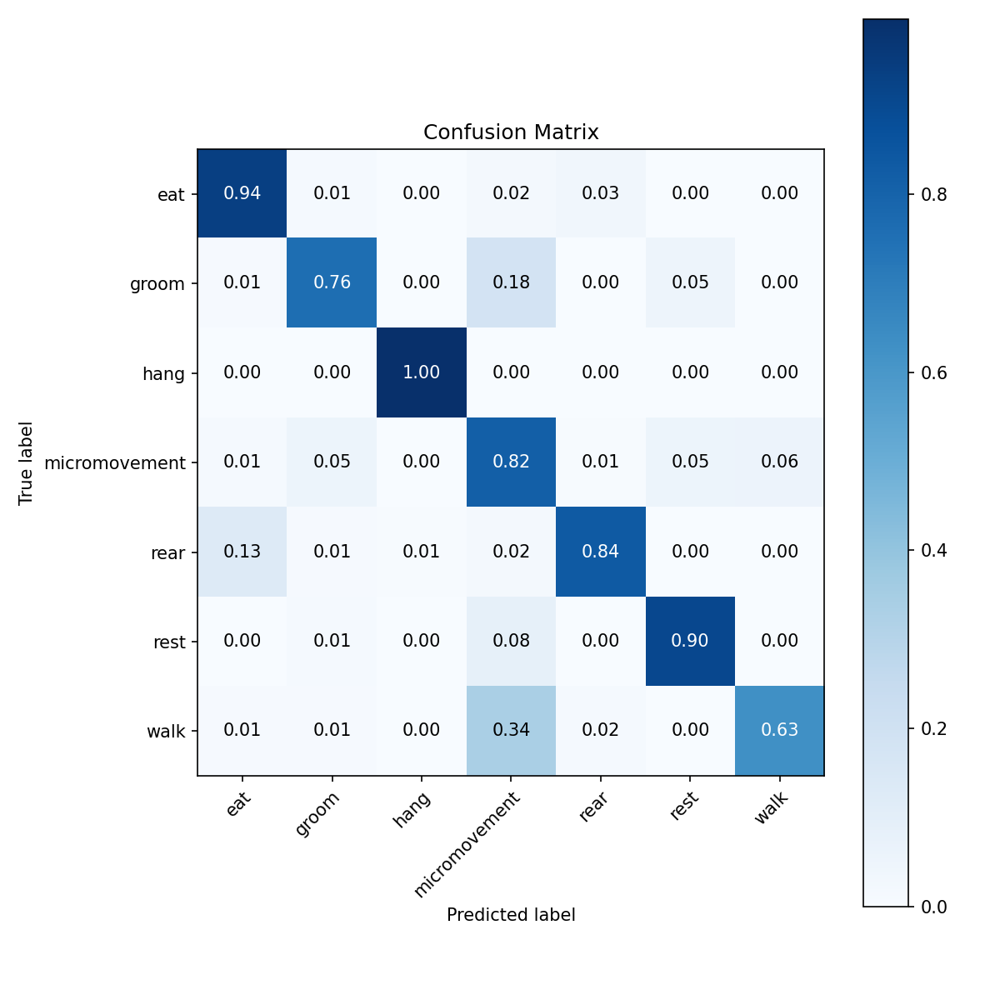

# Mice Pose Tracking & Behavior Classification
**── 利用 YOLO 偵測小鼠關鍵點，結合時空圖卷積與序列模型進行行為分類**  

## 特色
- **YOLO Pose**：基於 Ultralytics YOLOv11 偵測 8 點骨架  
- **多種行為模型**：BiLSTM、ST-TR、STTR_BiLSTM、ST-GCN 等  
- **自動化流程**：影片擷取 → 關鍵點預測 → 行為辨識 → 結果整合  
- **雙介面支援**：PyQt5 GUI／CLI 批次推論  

## 專案架構
```bash 
├── src
│   ├── gui
│   │   ├── gui_display.py              # GUI 播放器設定
│   │   ├── inference.py                # 模型推論架構
│   │   ├── main.py                     # 專案主程式（載入 GUI + 推論）
│   │   └── gui_config.yaml             # GUI 相關超參數
│   │
│   └── utils
│       ├── build_feature.py            # 建立 feature_vector (train/inference)
│       └── model_factory.py            # 將輸入轉成各模型所需格式
│
├── model
│   ├── YOLO
│   │   ├── train_YOLO.py               # YOLO 模型訓練腳本
│   │   ├── yolo_config.yaml            # YOLO 訓練超參數
│   │   └── YOLO_weights/               # 訓練後權重與 results
│   │
│   └── behavior_model
│       ├── models/                     # 不同行為模型的 class 定義
│       ├── train.py                    # 行為模型訓練入口
│       ├── trainer.py                  # 訓練流程 & checkpoint 儲存
│       ├── datasets_loader.py          # Dataset 與 DataLoader 建立
│       └── train_utils/                # 行為模型所需資料處理函式
│
├── data
│   ├── gt_dataset
│   │   ├── 0_frames/                   # video 擷取出之圖片
│   │   ├── 1_keypoints/                # Roboflow 標註關鍵點資料
│   │   ├── 2_gt_behaviors/             # Ground‐Truth 行為標註 CSV
│   │   └── 3_pred_kpt_gt_behavior/     # YOLO Kpts + GT 行為合併 (訓練用)
│   │
│   └── prediction_results
│       ├── 1_keypoints/                # YOLO Pose 預測輸出關鍵點
│       ├── 2_behaviors/                # 關鍵點 → 行為預測結果
│       └── 3_combine/                  # Kpts + 行為 → 完整預測結果
│
└── tools
    ├── prepare_data
    │   ├── frame_cap.py                # 影片截圖 (手動標記用)
    │   └── merge_kpts_gt_behavior.py   # 合併 Kpts 與 行為 GT
    │
    └── prediction_tools
        ├── video_to_keypoints.py       # 影片 → YOLO Pose → 關鍵點
        ├── kpts_to_behaviors.py        # Kpts → 行為預測 CSV
        └── video_pred_pipeline.py      # 影片→Kpts→行為 csv 整合流程

```

## 環境與安裝
1. **Clone 專案**
   ```bash
    git clone https://github.com/michael3abc/Mice_Tracking_Project.git \
    && cd Mice_Tracking_Project
   ```

2. **建立虛擬環境並安裝依賴**
   python -m venv .venv
   source .venv/bin/activate  # 或 Windows: .venv\Scripts\activate
   pip install -r requirements.txt

3. **下載模型權重**
   YOLO Pose: [下載連結](https://drive.google.com/drive/folders/12jgkvQenM3ELlXaIJhsG4d3zrISqaoGt?usp=drive_link)
   Behavior models: [下載連結](https://drive.google.com/drive/folders/196dMhi7VHGWXvNEQOBu1aVNC_n0ip9T5?usp=drive_link)
   data: [下載連結](https://drive.google.com/drive/folders/1UnfhMxMBjFP7bpSWuiPisjmLjdhKdhey?usp=drive_link)

## 前處理流程
1. 影片 -> YOLOv11 預測關鍵點
2. 清理異常值、線性插值補缺失 → 輸出 CSV  
3. Bout 分群後 Sliding Windows 切片  

## 特徵擷取
1. **關鍵點標準化**：相對於影像寬高→[0,1]  
2. **速度／加速度**：一階、二階差分  
3. **軀幹夾角**：nose→body 與 body→tail 夾角  
4. **關鍵點距離**：nose↔tail、front↔rear  
5. **鼻子方向**：速度向量單位化  
6. **速度統計**：區分靜止／微動  
7. **先驗框位移**：先驗框中心位移  

## 模型架構
- **YOLO Pose**（Ultralytics YOLOv11）：輸出 8 點 keypoints  
- **STTR_BiLSTM**：  
  1. ST-GCN 抽取時空圖特徵  
  2. Transformer 時間/空間注意力  
  3. BiLSTM 分類  
  
## 實驗結果
- **Best Val F1**：0.874 @ epoch 25 
- **Test F1**：0.804  
- 

## 參考資料
- 待補